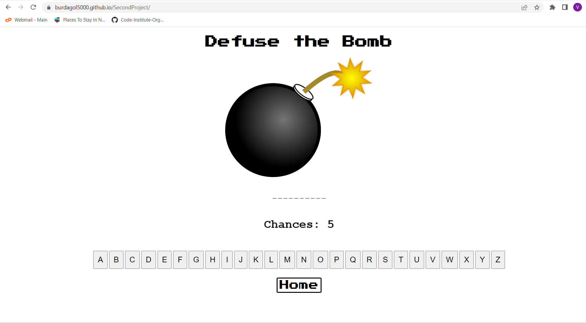
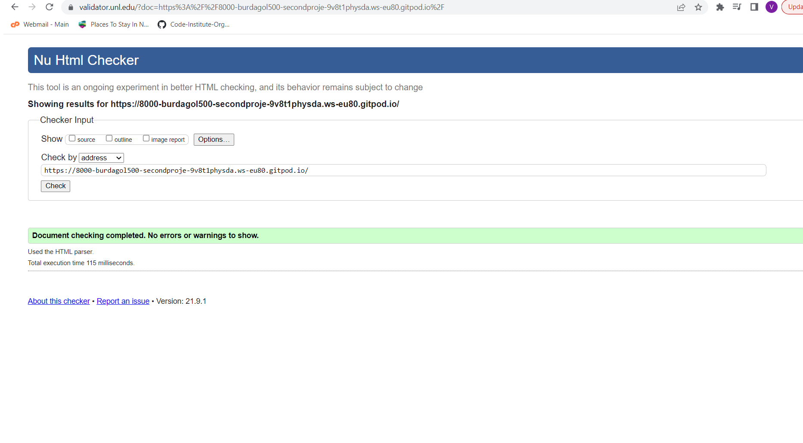
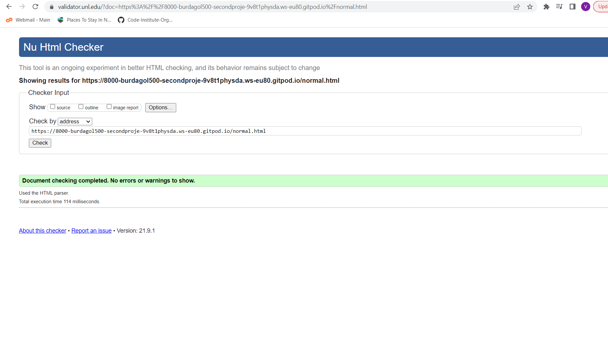
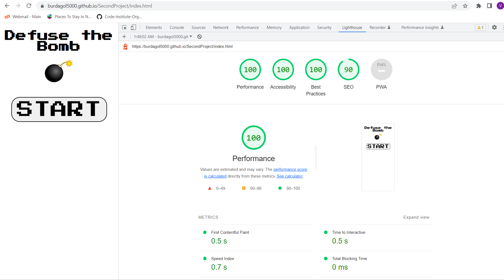
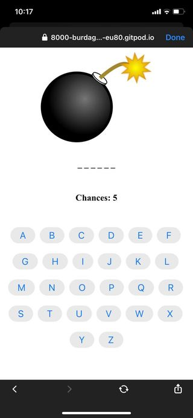

<h1>Defuse the Bomb</h1>

 The Game is called Defuse the bomb. Players have to guess the random word that was chosen by the system before they ran out of chances. Players will be given 8 chances on normal difficulty and 5 chances on hard difficulty. The words on normal difficulty are all about animals, places and colors, and on the Hard will be about every single word you could think of.

We will continue to develop the game please stay tuned for future updates.

<h1>Features</h1>
In Defuse the Bomb you will have to guess the word by clicking on the letter until you guessed all the letter that the random word is comprised of. On normal difficulty you will be given 8 chances to choose the correct letters until you got them all correct. Normal Difficulty has words that are comprised of color, animals and places. On Hard difficulty you are given 5 chances to select the correct letters. The words on Hard difficulty are anything out of the sun that you could think of soo be very careful on selecting the letters. 

</img>

<h2>Technologies Used</h2>
<ul>
<li>HTML</li>
<li>CSS</li>
<li>Javascript</li>
</ul>

<h1>Validation</h1>
<h2>HTML Validation for the Index.html</h2>

</img>
 
<h2>HTML Validation for the normal.html</h2>
 
</img>
 
<h2>HTML Validation for the hard.html</h2>
 
</img>
 
<h2>CSS Validation</h2>
</img>

<h2>Performance Validation using Lighthouse</h2>
</img>

<h2>Testing it on my Mobile Phone</h2>
</img>

<h2>Deployment</h2>

My Site was Deployed using Github Pages. The steps I took were as follows: 
1. On the repository Page, Click on the settings icon.  
2. On the left hand side corner click pages on the menu. 
3. On the branch selected Main, then on the folder selected root then clicked save.
4. After a few minutes Github has generated my website which has a URL of: https://burdagol5000.github.io/SecondProject/

<h2>Credits</h2>

<ul>

<li>Javascript Tutorial from SuperSimpleDev on Youtube (https://www.youtube.com/@SuperSimpleDev)</li>
<li>Javascript Tutorial from Programming with Mosh (https://www.youtube.com/@programmingwithmosh)</li>
<li>Javascript Tutorial from freeCodeCamp.org (https://www.youtube.com/@freecodecamp)</li>
<li>Form Validation from Code Institute LMS</li>
<li>stack overflow forums for answering some of my questions. https://stackoverflow.com/questions/</li>
</ul>
