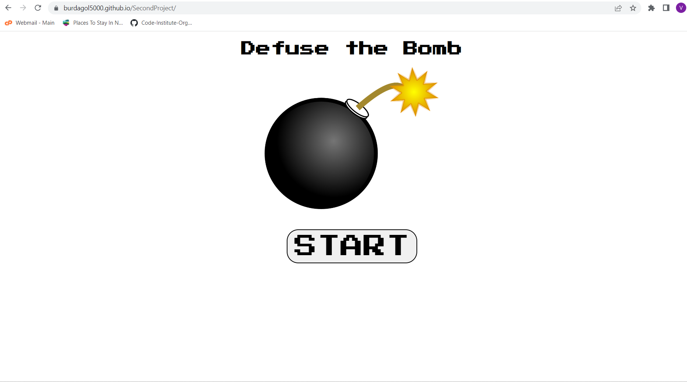
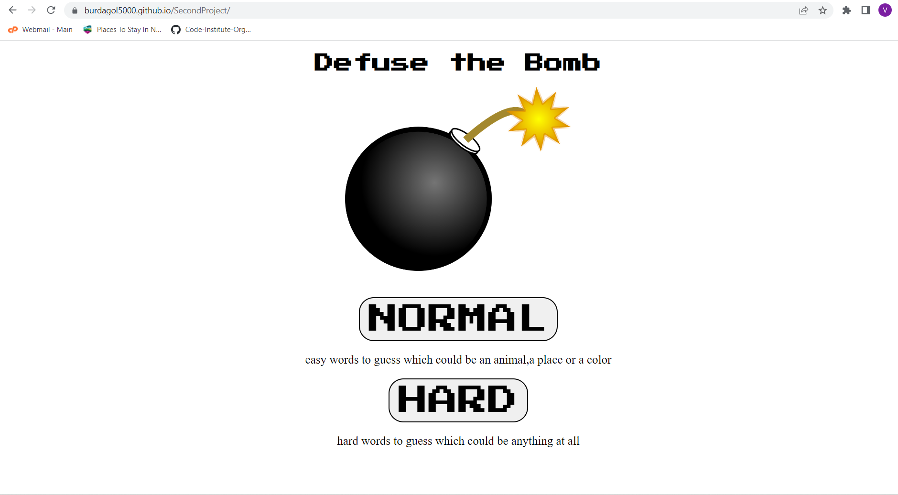
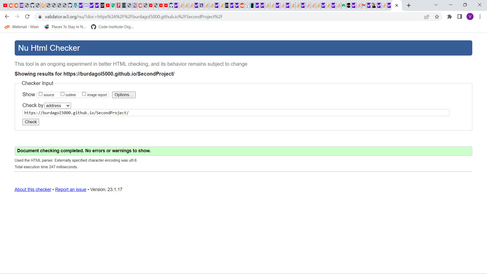
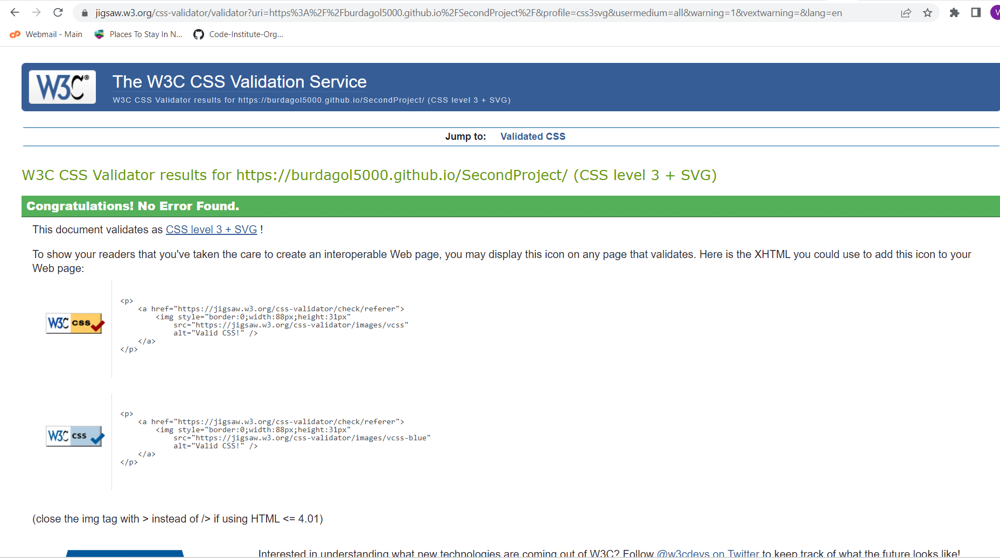
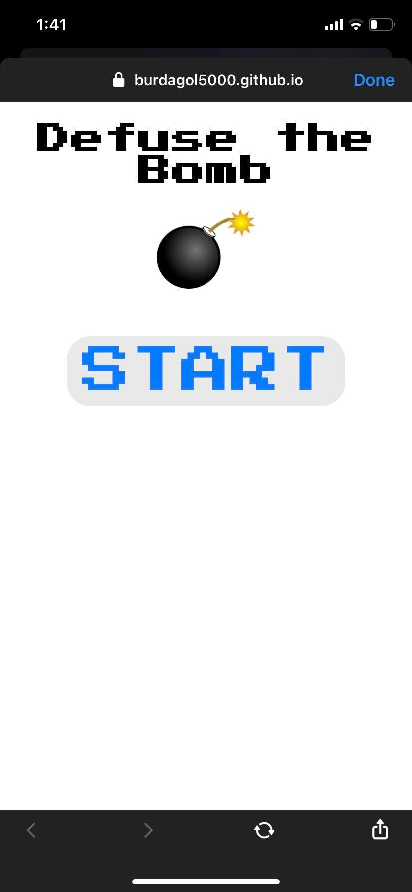
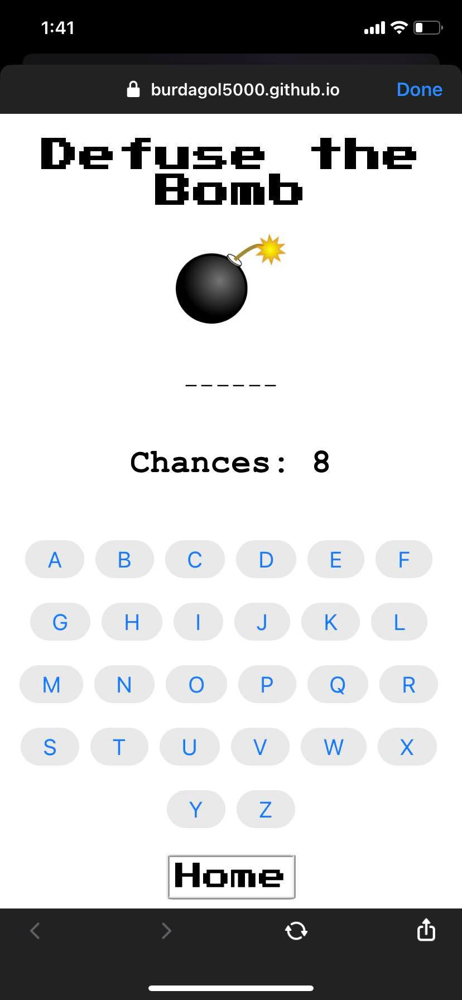

<h1>Defuse the Bomb</h1>

 The Game is called Defuse the bomb. It is made from the combination of HTML, CSS and Javascrip. Players have to guess the random word that was chosen by the system before they ran out of chances. Players will be given 8 chances on normal difficulty and 5 chances on hard difficulty. The words on normal difficulty are all about animals, places and colors, and on the Hard will be about every single word you could think of.

We will continue to develop the game please stay tuned for future updates.

<h1>Features</h1>
In Defuse the Bomb you will have to guess the word by clicking on the letter until you guessed all the letter that the random word is comprised of. On normal difficulty you will be given 8 chances to choose the correct letters until you got them all correct. Normal Difficulty has words that are comprised of color, animals and places. 
</img>

On Hard difficulty you are given 5 chances to select the correct letters. The words on Hard difficulty are anything out of the sun that you could think of soo be very careful on selecting the letters. 

</img>

<h2>Technologies Used</h2>
<ul>
<li>HTML</li>
<li>CSS</li>
<li>Javascript</li>
<li>Font Awesome</li>
</ul>
<h2>Design Process</h2>
The Design of Defuse the bomb is a simple design using just the background color of White. Then hovering on the buttons will change the color from white to black and the text color to white. It's simple design was for simplistic game experience. I chose the red color for the Reset button when you finish the game since it really highlights the button. Overall Defuse the bomb has a very simple design. In the future we will continue to update its design to give a better player UI.

 
<h2>Development Process</h2>
Defuse the bomb was made from the combination of HTML, CSS and Javascript. The development process of Defuse the bomb was at first I had coded the simple index.html. Then I had to make a div that will disapper whenever player clickes on the start button then another div that will appear which contains the difficulty buttons. Afterwhich I had to create another div which will comprise of the game itself and which would only appear when player has selected chosen difficulty settings. At first I was using onclick function on my button but due to some corrections I changed them to event listeners. After finishing up my index.html I created the intro.js file which will hold the event handler function for the start button. Then created game.js which will contain most of the functions used to play the game. On game.js at first i created the eventhandlers after selecting the difficulty. Afterwhich I declared my variables and started coding my functions. And lastly I did the CSS last since CSS is kind of my weakness since of my still developing skills on designing.

 
 
 
<h1>Validation</h1>
<h2>HTML Validation for the Index.html</h2>

</img>
 
 
<h2>CSS Validation</h2>
</img>

<h2>Performance Validation using Lighthouse</h2>
</img>

<h2>Testing it on my Mobile Phone</h2>
</img>
</img>

<h2>Testing on my Laptop</h2>
</img>
</img>
  
 
<h2>BUGS</h2>
<ol>
<li>The function level() was not clearly passing the array to the randomWords variable which was needed on randomWord function to get a random word from the list on the array. Was able to solve it when I called the functions randomWord,buttonsGenerated and wordChallenge inside the if statements rather than outside the function of level.
<li>The changes I made on gitpod was not reflecting on real time. Solved the problem when I unpublish and republish my page.
<li>The argument I wanted to pass using the eventhandler was not being passed. Solved the problem by searching how to pass arguments using the eventhandler.</li>
</ol>
<h2>Future Updates Planned</h2>
<ul>
<li>Scoring System for players</li>
<li>Input of player name and storing them with their score</li>
<li>More Difficulty Settings</li>
<li>More words from the category</li>
<li>Player that scored the highest for the Month will get his name posted on the frontpage for the month.</li>
</ul>
<h2>Deployment</h2>

Defuse the Bomb was Deployed using Github Pages. The steps I took the deploy Defuse the Bomb were as follows: 
1. On the repository Page, Click on the settings icon.  
2. On the left hand side corner click pages on the menu. 
3. On the branch selected Main, then on the folder selected root then clicked save.
4. After a few minutes Github has generated my website which has a URL of: https://burdagol5000.github.io/SecondProject/

<h2>Credits</h2>

<ul>
<li>Javascript Tutorial for beginners from SuperSimpleDev on Youtube (https://www.youtube.com/watch?v=DqaTKBU9TZk&t=3636s)</li>
<li>Javascript Tutorial for beginners from Programming with Mosh (https://www.youtube.com/watch?v=W6NZfCO5SIk&t=1s)</li>
<li>Javascript Tutorial for beginners from freeCodeCamp.org (https://www.youtube.com/watch?v=PkZNo7MFNFg&t=3832s)</li>
<li>Form Validation from Code Institute LMS</li>
<li>stack overflow forums for answering some of my questions. https://stackoverflow.com/questions/</li>
<li>W3schools for the tutorials especially the eventhandlers (https://www.w3schools.com/js/js_htmldom_eventlistener.asp)
<li>W3schools for the ES6 features list (https://www.w3schools.com/Js/js_es6.asp)
<li>Google Fonts for the font I used on Defuse the bomb (https://fonts.google.com/)
</ul>
